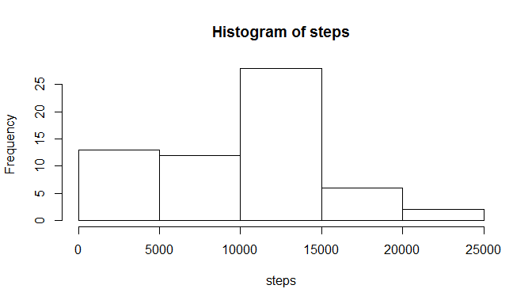
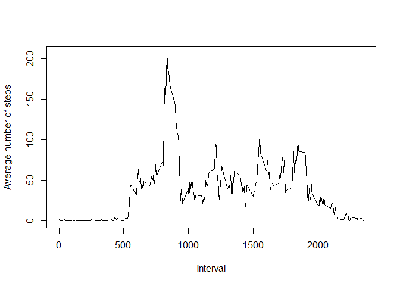
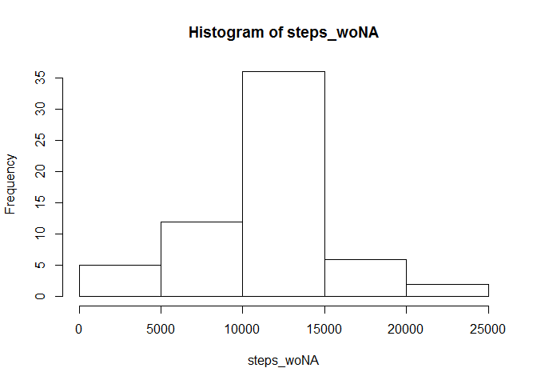
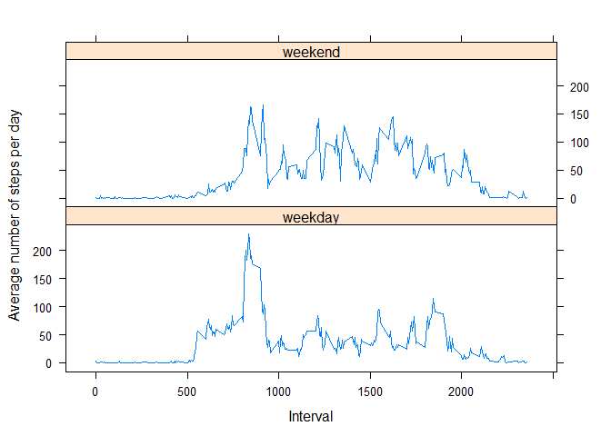

# Reproducible Research: Peer Assessment 1


## Loading and preprocessing the data
Loading data from csv file, which is in the current directory.

```r
data <- read.csv(file = 'activity.csv')
```

## What is mean total number of steps taken per day?
 

Average number of total steps per day is 9354 and median number 
of total steps per day is 10395.

## What is the average daily activity pattern?

```r
patt <- tapply(X = data$steps, INDEX = data$interval,FUN = mean, na.rm = TRUE)
biggest <- as.numeric(dimnames(patt)[[1]][patt == max(patt)])
plot(patt ~ dimnames(patt)[[1]], type = 'l', xlab = 'Interval', 
     ylab = 'Average number of steps')
```

 

Interval 835 containts the maximum number of steps on average across all the days.

## Imputing missing values

Filling the missing values as the average number of steps in this 5-minute interval during the other days:


```r
totalNAs <- sum(is.na(data$steps))
to_correct <- data[is.na(data$steps),]
for (i in (1:dim(to_correct)[1])) {
    to_correct$steps[i] <- patt[dimnames(patt)[[1]] == to_correct$interval[i]]
}
newdata <- rbind(to_correct, data[!is.na(data$steps),])
```

Histogram of filled data:


```r
steps_woNA <- tapply(X = newdata$steps, INDEX = newdata$date,FUN = sum, na.rm = TRUE)
st_mean_woNA <- format(mean(steps_woNA), digits = 2)
st_median_woNA <- format(median(steps_woNA), digits = 2)
hist(steps_woNA)
```

 

Now, average number of steps is 10766 and median is 10766, which are higher than without imputing missing values. Also, after filling missing values by this method, we got more centered ditstribution.

## Are there differences in activity patterns between weekdays and weekends?

Adding new column to dataset:

```r
newdata$weekday <- 'weekday'
newdata[weekdays(as.Date(newdata$date)) %in% c('субота', 'неділя'), 
        'weekday'] <- 'weekend'
newdata$weekday <- as.factor(newdata$weekday)
```

Preparing data for plotting:


```r
steps_day <- aggregate(x = newdata$steps, by = list(newdata$interval, newdata$weekday),FUN = mean,simplify = TRUE)
names(steps_day) <- c('Interval', 'Day', 'Steps')
steps_day$Day <- as.factor(steps_day$Day)
```

Plot for comparement of weekends and weekdays:


```r
library(lattice)
xyplot(Steps ~ Interval | Day, data = steps_day, type = 'l',layout = c(1,2), ylab = 'Average number of steps per day')
```

 


